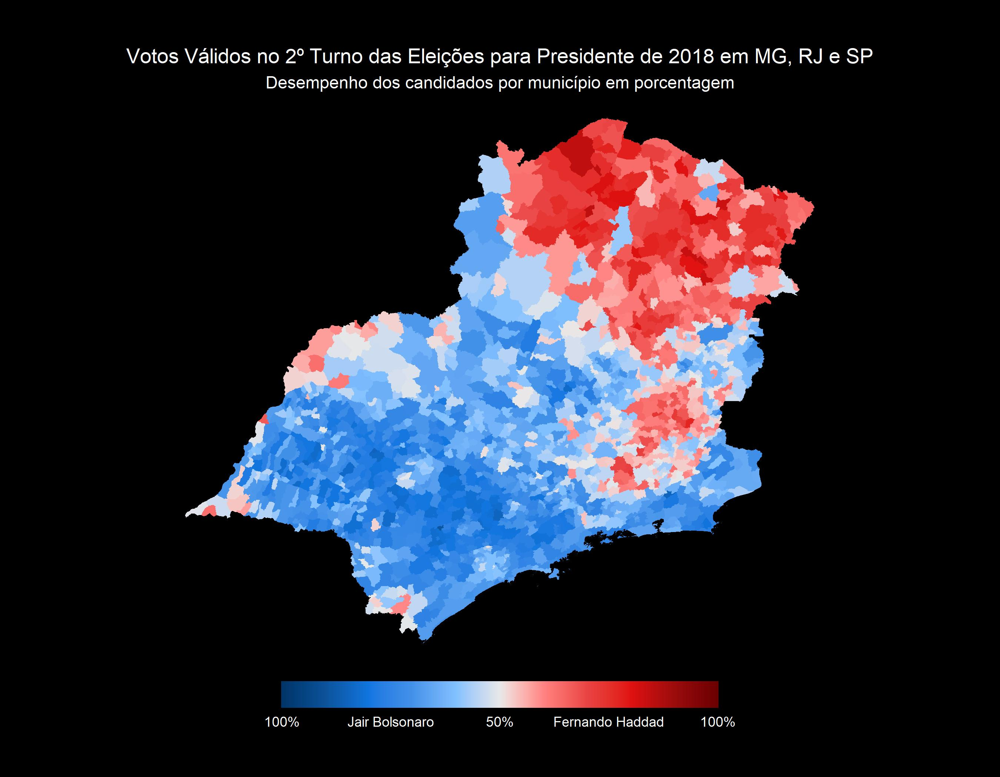

# Brazilian Elections

Project aimed at graphic analysis of election results in Brazil between 2010 and 2022.

It seeks to show new angles to glimpse the power and distribution of votes, enabling reflection and insights.

